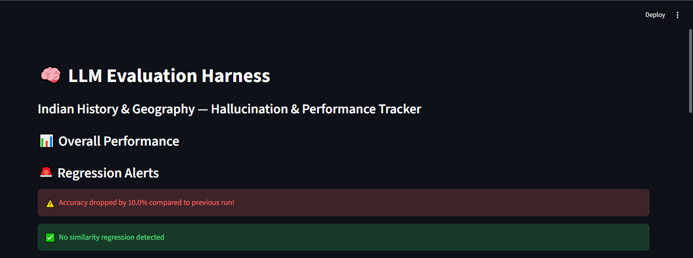
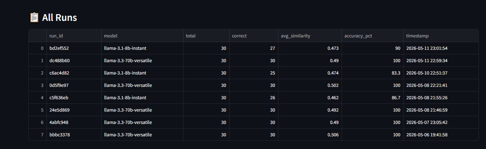

# 🧠 LLM Evaluation Harness

An automated evaluation and hallucination detection system for Large Language Models, built with Python, DuckDB, and Streamlit.

## What it does
- Runs a curated test suite of 30 Indian History & Geography questions against any LLM
- Scores answers using both exact match and semantic similarity (sentence-transformers)
- Detects potential hallucinations by checking if claims are grounded in reference answers
- Stores every run permanently in a DuckDB database with timestamps and model names
- Displays performance trends, model comparisons, and per-question drilldowns in a live Streamlit dashboard

## Screenshots

### Regression Alert & Overall Performance

### Key Metrics

### All Runs Table

## Key findings
- `llama-3.3-70b-versatile` scored 30/30 (100% accuracy, 0.49 avg similarity)
- `llama-3.1-8b-instant` scored 26/30 (86.7% accuracy, 0.46 avg similarity)
- Smaller models fail more on spelling variants and factual recall questions

## Tech stack
- Python 3.13
- Groq API (free tier) for LLM inference
- sentence-transformers (all-MiniLM-L6-v2) for semantic similarity
- DuckDB for run storage and analytics
- Streamlit for the dashboard

## Project structure
- `runner.py` — main eval loop, calls LLM, scores answers, saves to DB
- `scorer.py` — semantic similarity scoring using sentence-transformers
- `database.py` — DuckDB setup, save and retrieve runs
- `dashboard.py` — Streamlit dashboard with charts and drilldowns
- `test_cases.json` — 30 curated questions with reference answers and sources

## How to run

1. Clone the repository
2. Install dependencies:
   pip install requests python-dotenv duckdb sentence-transformers streamlit scikit-learn torch
3. Create a .env file with your Groq API key:
   GROQ_API_KEY=your_key_here
4. Run the evaluation:
   python runner.py
5. Launch the dashboard:
   streamlit run dashboard.py

## Run with a specific model
   python runner.py llama-3.1-8b-instant